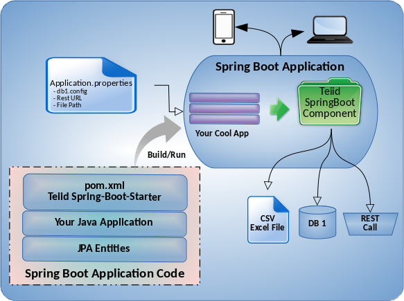

[**Teiid 4 Ways**](..) &nbsp;&nbsp; <  &nbsp;&nbsp; [Wildfly] (../teiid_wildfly) &nbsp;&nbsp; | &nbsp;&nbsp; [Wildfly Swarm](../wildfly_swarm) &nbsp;&nbsp; | &nbsp;&nbsp; **Microservices** &nbsp;&nbsp; | &nbsp;&nbsp;  [Embedded](../embedded)

</img>

---

The Teiid project includes a feature to help you develop data services within Spring applications and expose them as microservices.

### [**Teiid Spring Boot**](https://github.com/teiid/teiid-spring-boot)

.... is a framework for developing Spring applications that utilize Data Virtualization features. Data Virtualization technology provides seamless integration with multiple hetrogenious data sources. For example, you can combine data from Oracle database with data from Microsoft SQL Server, REST Service, Flat File etc. You not only integrate the data, you can also create your own Views of that integrated data. The Data Virtualization technology is based on Teiid

Teiid Spring Boot is a new bootstapping mechanism of Teiid that is developed in keeping up with developers and their usage of Annotations with Spring application at its core. If you are familiar with using the JPA or JDBC template model in a Spring application, then most of learning is already done.

For more details see:

## - [Source](https://github.com/teiid/teiid-spring-boot)

## - [User Guide](https://github.com/teiid/teiid-spring-boot/blob/master/docs/UserGuide.adoc)

## - [Reference Guide](https://github.com/teiid/teiid-spring-boot/blob/master/docs/Reference.adoc)

---
